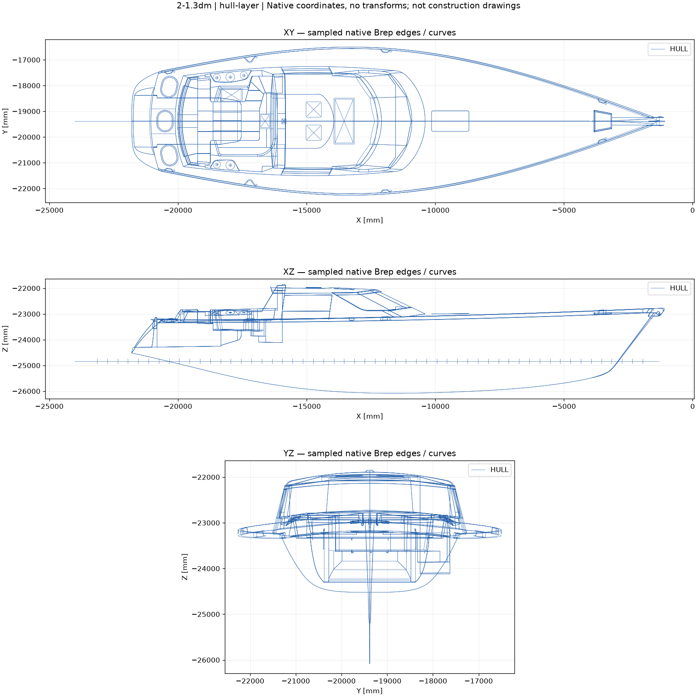

# G01 — исходная геометрия перед компоновкой

10.09.2026. Начальник `/root`; исполнители `rhino_geometry`, `dwg_geometry`, `geometry_survey`; независимый проверяющий `geometry_review`. База: `f03ea5c3f8a07b5bba55d62fec073f18b85de3e8`.

**Исходная 3D-геометрия корпуса, палубы, рубки и кокпита доступна для дальнейшего изучения. DWG прочитан с существенными ограничениями конвертации.** Получены отдельные проекции, описи объектов и адресный план обмеров. Проверенного исполнительного плана корпуса, согласованной системы координат всех файлов и полной внутренней компоновки этот комплект пока не даёт.

Все исходные файлы сохранены без изменений. Производные результаты отделены от оригиналов. Будущие переделки записаны как намерения, а не внесены в исходную геометрию.

## Что удалось установить

| Источник | Фактический результат | Для чего пригоден сейчас | Что остаётся открытым |
|---|---|---|---|
| 3DM, DOC-001 | Rhino3 прочитан; миллиметры; 491 объект, включая 314 Brep. Выделены наружные поверхности, палуба, верх рубки и локальные внутренние поверхности | Историческая геометрическая подоснова наружной формы; выбор элементов по устойчивым ObjectID | Полный силовой набор, переборки, чистые внутренние высоты, полы всех помещений, сборки киля/балласта/руля и соответствие нынешнему корпусу |
| DWG, DOC-002 | AC1018; 1241 верхнеуровневый объект Model, 68 слоёв, в том числе пространственные линии и шаблоны шпангоутов. INSUNITS=0 | Чтение формы, слоёв, подписей и поиск реперов для сопоставления | Физическая единица координат явно не назначена; конвертация имеет CRC/служебные ошибки и отсутствующие определения блоков; полнота не подтверждена |
| PDF, DOC-003/004 | Исторические General layout и Sailplan; заново просмотрены | Назначения зон, взаимное положение уровней, проектные обозначения и контекст вооружения | Масштаб штампа не калибрует автоматически скан; расположение мебели и двигателя не доказывает их установку |
| Фото и малый эскиз, DOC-005/006 | Фото показывает наружную переднюю область рубки/палубы; эскиз низкого разрешения | Общая визуальная ориентация и адреса будущих проверок | На фото не видны внутренние конструкции и кормовые отсеки; дата/актуальность состояния не установлены |

[Разбор Rhino](01_support/rhino/00_rhino-inspection.md), [разбор DWG](01_support/dwg/00_dwg-inspection.md), [основания обмера](01_support/survey/00_survey-basis.md).

## Рабочие изображения исходной формы

[Проекции корпуса, палубы, рубки и кокпита из Rhino](01_support/rhino/hull-layer-projections.png):

Отдельно выделены [наружные поверхности корпуса](01_support/rhino/shell-surfaces-projections.png), [палубная поверхность](01_support/rhino/deck-candidate-projections.png) и [верхние поверхности рубки](01_support/rhino/roof-candidates-projections.png). Это дискретные изображения исходных кромок; они не являются размерными строительными чертежами.

Для DWG доступны [три проекции линейной геометрии](01_support/dwg/orthographic-linework.png), [вид XY](01_support/dwg/lines-derived-preview.png) и [производный DXF](01_support/dwg/lines-derived.dxf). В изображениях DWG есть явно указанные исключения, поэтому пользоваться ими как доказательством полной конвертации нельзя.

## Почему пока не объединяем все файлы в один размерный план

**Разные координатные представления.** В Rhino продольное направление распознаётся по X, поперечное по Y, вертикальное по Z; модель существенно смещена относительно начала координат. В DWG по геометрии распознаются X поперёк, Y вверх, Z вдоль. Это интерпретация видов, не принятая судовая система координат. Идентичные реперы, знаки осей, масштаб и перенос ещё не установлены. Численной сшивки файлов не выполнялось.

**Разные реквизиты источников.** В тексте DWG — FULL SIZE FRAME PATTERNS, 430-2-0, 7-6-'96, масштаб 1:1. В PDF — 430A-7-1 / 430A-8-1, 21.05.2001. Дата в штампе не доказывает дату каждого CAD-объекта или несовместимость геометрии. Редакции сохраняются раздельно до сопоставления.

**Габарит файла не равен габариту яхты.** В Rhino диагностические bbox обрезанных поверхностей сильно расходятся с выборкой реальных кромок. Независимая проба для двух выбранных наружных поверхностей подтвердила приблизительный охват 20,291 × 5,755 × 3,290 м. Это охват выборки этих поверхностей, не LOA, осадка или высота борта. Допуск модели 0,01 мм — настройка файла, а не точность нашего результата. В DWG общий EXTMIN/EXTMAX включает служебную геометрию и также не задаёт размеры судна.

**DWG импорт ограничен.** Оба вызова LibreDWG завершились с кодом 0, но логи содержат ошибки CRC/секций/handles. В отдельной копии для визуализации аудит удаляет две ссылки INSERT без определения BLOCK; исходный DWG и сохранённый DXF не исправлялись этим аудитом. Нельзя доказать, что всё затронутое содержимое несущественно. Причина ошибок не установлена; оригинал не объявлен повреждённым. Подробности и журналы сохранены в разборе DWG.

## Связь с будущими переделками

[Реестр намерений FC-01–FC-04](../../../data/office/design-intents.csv) сохраняет формулировки владельца и границы неопределённости.

| Намерение | Что сохраняем и проверяем сейчас |
|---|---|
| Удлинение вперёд и подъём крыши | Исходные поверхности рубки/крыши, уровни, передняя граница и примыкание к палубе. Предмет и величина удлинения не назначены; это не решение удлинить корпус |
| Хардтоп над кокпитом | Геометрия кокпита, опоры/силовые связи, доступ и связь с гиком, вооружением и обзором |
| Переделка кормы под гараж | Кормовые сечения, существующие границы отсеков, танки, рулевое, жилые зоны и доступ |
| Тендер типа Williams, занос боком кран-балкой | Полный габарит и масса будущей конкретной модели, проём, ориентация хранения, путь движения и места опор. Модель, сторона загрузки и траектория пока не определены |

Новые контуры крыши, хардтопа и кормы в G01 не создавались; оборудование и кран-балка не подбирались.

## Что требуется для надёжной основы компоновки

Подготовлены [14 адресных заданий обмера](01_support/survey/survey-checklist.csv): от общих реперов до переборок, опор полов, машинного объёма, крыши, кокпита и кормы. Указаны места, назначение, методы, приоритеты и связи с будущими изменениями. Все задания имеют статус PLANNED_NOT_MEASURED. Точность и плотность съёмки должны быть назначены по задаче; произвольных универсальных миллиметров не введено.

Следующая самостоятельная работа отдела — подготовить контролируемую координатную привязку и набор сопоставимых сечений: сначала одинаковые реперы DWG/3DM/PDF, затем таблица расхождений, после этого допустимые исходные зоны для вариантов. Для DWG отдельно требуется проверка отсутствующих блоков и импорта другим CAD-средством. Натурные размеры и фактическое состояние можно подтвердить только данными обследования; публичные аналоги этого не заменяют.

Пока можно изучать варианты на исторической модельной подоснове с явной маркировкой допущений. Количества для изготовления и сметы по её непроверенным внутренним габаритам не назначены.

## Контроль и сопровождение

[Независимая проверка](01_support/review/00_review.md) содержит отдельное воспроизведение выбранных извлечений и границы контроля. Общая папка [01_support](01_support/) объединяет методы, описи, производные файлы, журнал конвертации и задание на обмер. Локальные инструменты установлены изолированно в `.local/cad-tools/`; исходные чертежи не передавались онлайн-конвертерам.

Проверка чтения файла не равна утверждению конструкции или её состояния. Принятие G01 ограничивается документальным/геометрическим разбором; дальнейшая конструкторская работа использует перечисленные незакрытые вопросы.
