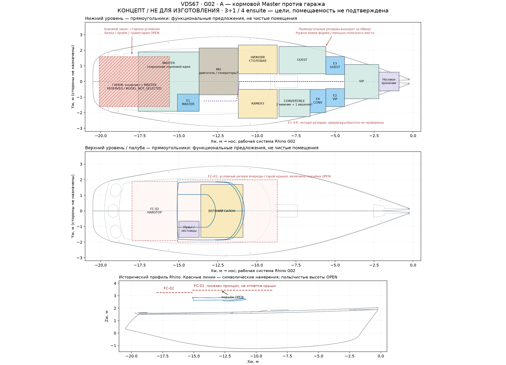
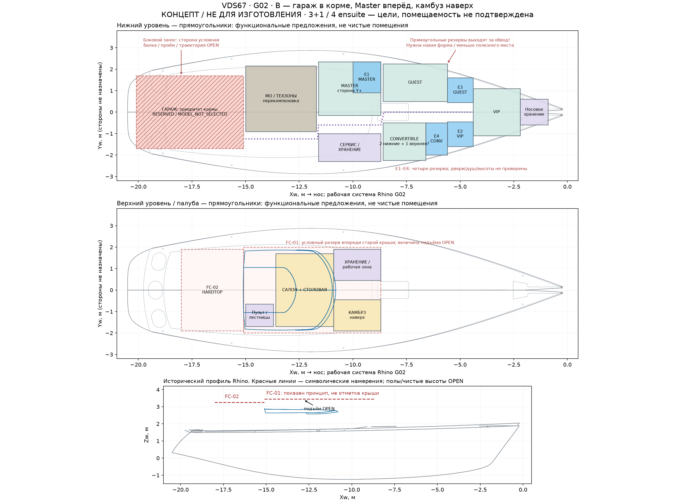

# G02 — геометрическая основа и первые варианты компоновки

10.09.2026 · Большой спринт проектного офиса VDS67 · Польша / Европа.

Подготовлены два сравнимых концепта на извлечённой геометрии Rhino, рабочая система координат с обратным преобразованием и проверка DWG другим CAD-движком. **Это основа следующей итерации планировки; помещаемость и конструктивная реализуемость пока не подтверждены.** Три профильных агента выполнили работу, отдельный агент проверил существенные результаты; решение о выпуске фиксируется в [приёмке](01_support/00_acceptance.md).

Все материалы собраны в [одной папке сопровождения](01_support/). Исходные чертежи сохранены без изменения. Предыдущие выпуски G01 и O02 остаются самостоятельными версиями.

## Два направления

| Вариант | Что предлагается | Главный конфликт |
|---|---|---|
| **A — сохранить кормовой Master** | Историческая логика жилых зон, нижний камбуз, верхний салон; гараж наложен как требование | Резерв гаража пересекается с Master на одном уровне. Разнести их по высоте пока нечем обосновать |
| **B — освободить корму под гараж** | Master переносится вперёд, камбуз — наверх; кормовой объём защищён под будущий гараж | Master теряет полный поперечный объём; верхний камбуз зависит от допустимого развития рубки и высоты. Перестановка технической зоны требует проверки |

На схемах показаны **функциональные резервы**, а не готовые стены и мебель. В обоих вариантах передние прямоугольные зоны местами выходят за наружную проекцию корпуса: нужны формы по сечениям и реальная расстановка. Цель 3 основных каюты + Convertible и 4 собственных санузла сохранена, но ещё не выполнена проверяемой планировкой. Чистые проходы, двери, души и все состояния коек остаются открытыми.

**Для следующей проверки приоритет B:** он непосредственно освобождает корму для намерения владельца. Это порядок исследования, не утверждение варианта. A нужен как сравнение последствий сохранения кормового Master. Подробности, 35 резервов зон и 14 критериев — в [разборе компоновки](01_support/layout/00_layout-options.md).

Крыша вперёд/выше, hardtop и кормовой гараж учтены как FC-01–FC-04. Показанное развитие рубки — условный сценарий: предмет удлинения ещё не определён, удлинение корпуса не назначено. Высота и конструкция крыши, модель Williams, борт загрузки, проём, кран-балка и траектория тендера не выбраны. Размер прямоугольника гаража не является паспортным габаритом тендера.

## Что стало надёжнее в исходных данных

**DWG прочитан вторым движком — ODA 27.1, без ремонта.** Сопоставлены 1241 объект Model. Две прежде потерянные ссылки INSERT связаны с несогласованными именами блоков в выводе LibreDWG; ODA сохраняет ссылки и те же 90 LINE в соответствующих блоках. Отдельный audit результата ODA не обнаружил ошибок и не внёс исправлений. Это уточняет G01-R06, но не закрывает полноту импорта целиком: различаются параметры 11 spline-полилиний и представление Z одной 2D-полилинии, физическая единица DWG не назначена. [CAD-протокол и сравнение](01_support/cad/00_cad-validation.md).

**Создана общая рабочая система для эскизов Rhino.** Сохранены 125 исходных кромок с ObjectID и обратными матрицами. Компоновка закреплена SHA файла подосновы; геометрия не подгонялась под желаемые помещения. Начало координат — вспомогательная линия модели, не установленная ватерлиния или форштевень.

**Связь DWG и Rhino подтверждается частично.** При гипотезе 1 мм/единицу DWG пять контрольных срезов палубной кромки дают расхождения 0,09–0,67 мм после переноса по одному кормовому реперу. Носовые концы расходятся примерно на 223 мм, но их соответствие друг другу не доказано. Четыре отдельных шаблона шпангоутов также сопоставлены с сеточными сечениями оболочки; это диагностика разных геометрических признаков, не допуск строительства. Полная идентичность редакций и соответствие построенному корпусу не установлены. [Матрицы, реперы и контрольные сечения](01_support/alignment/00_alignment.md).

## Следующий пакет G03 — проверка реального объёма

1. Построить доступные сечения на уровнях пола, коек, плеч и крыши. Отдельно показать наружную поверхность и неизвестные внутренние отступы; привязать недостающие данные к 14 заданиям обмера G01.
2. Переработать передние зоны по обводу: мебель, четыре мокрые зоны, двери, непрерывные проходы и Convertible во всех требуемых состояниях. Зафиксировать, какие цели проходят, а какие требуют компромисса.
3. Проверить корму как объём: несколько паспортных кандидатов тендера без цен и без выбора модели, положение хранения, путь бокового заноса, балку/опоры, рулевое, водонепроницаемые границы и доступ обслуживания.
4. Проверить техническую упаковку B: двигатель и валопровод, генераторы, танки, вентиляцию, маршруты извлечения; затем допустимый объём верхнего камбуза, развитие крыши и hardtop относительно мачты и парусов.

Критерий следующего результата — объёмная схема с проверяемыми пересечениями и явно невыполненными требованиями. Гидростатика, баланс массы, прочность новых конструкций и применимые требования получают отдельные расчётные задания по мере определения геометрии. Закупки, КП, КАЦ и УТВ остаются последующими этапами; в этом спринте ценовой пакет не составлялся.

[Независимая проверка](01_support/review/00_review.md) · [Решение начальника](01_support/00_acceptance.md) · [Манифест файлов](01_support/manifest.json).
