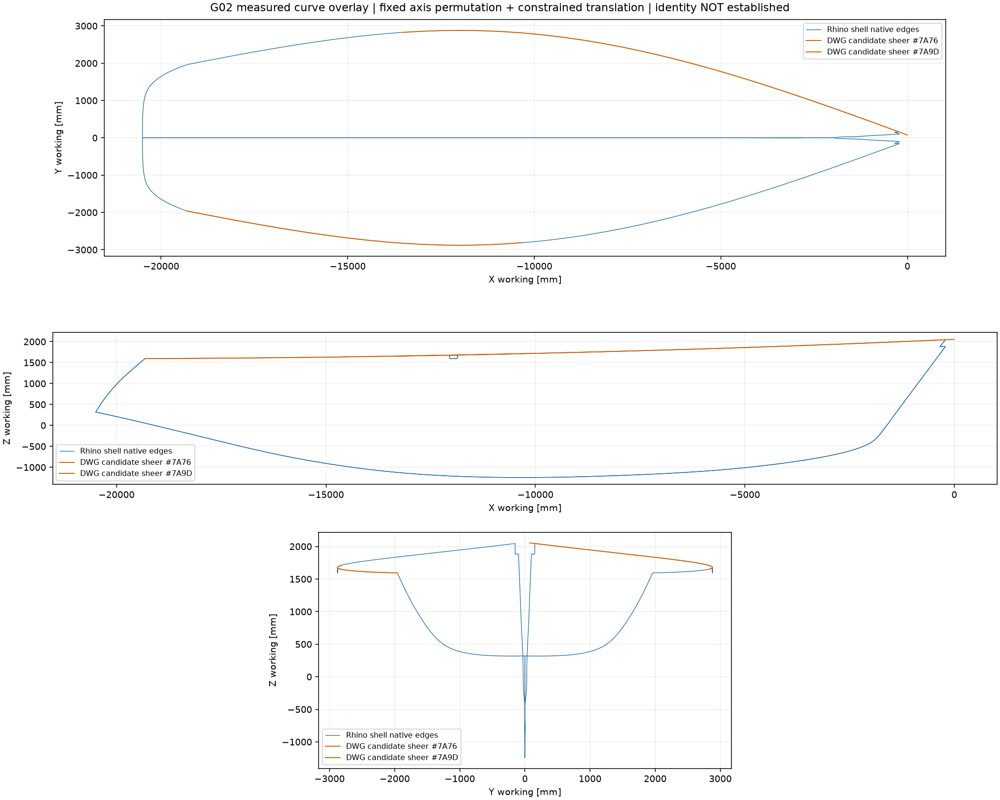
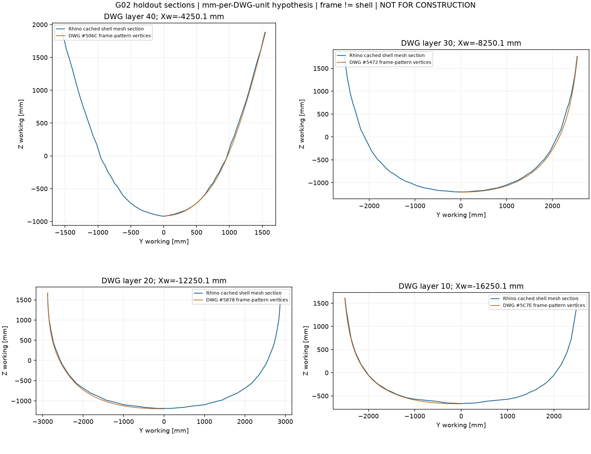

# G02 · Рабочие координаты и проверка связи DWG / Rhino

10.09.2026 · Исполнитель `/root/g02_alignment`. **PROVISIONAL_ALIGNMENT_NOT_IDENTITY_NOT_AS_BUILT**. Создана воспроизводимая координатная основа для концептуальной компоновки по исторической модели Rhino. Связь с DWG проверена на конкретных объектах; полная идентичность редакций и натурного корпуса не установлена.

Исходные CAD не изменены. Гидростатика, объёмы, силовые расчёты, производственные размеры и цены не вычислялись.

## Результат для компоновщика

[curves-working.json](curves-working.json) содержит группы оболочки, палубы, крыши и локальных вертикальных поверхностей: для каждой кромки — исходные ObjectID, индекс объекта/кромки, 257 точек и обе матрицы переноса. Это выборка кромок, а не замкнутые чистовые помещения. Автор вариантов должен ссылаться на SHA файла, а не повторно угадывать оси.

SHA-256 файла координат: `65206919803104ff3f0424c3f01770cab0909918bcf90644b56fff79addf63c1`.

Рабочие координаты, миллиметры:

```text
Xw = Xrhino + 1294.1600000000003
Yw = Yrhino + 19381.843773828055
Zw = Zrhino + 24837.674386867988
```

X растёт к носу, Y — поперёк, Z — вверх. Знаки Y пока не превращены в наименования левого/правого борта. Начало — конец с большим X геометрической линии #234, ObjectID `1c35489c-378d-490d-a766-7cada4f152ab`. **Xw=0 не является форштевнем; Zw=0 не является подтверждённой ватерлинией.** Линия расположена около надписей CWL1250; это источник удобной исторической плоскости, а не назначение загрузки яхты. Yw=0 согласуется с зеркальными оболочками и положением этой линии. Число знаков в матрице нужно для обратимого вычисления; оно не характеризует точность строительства.

Исходные опорные объекты: две оболочки #133 `47cc8bdb-89af-4af9-9312-275b5b3d047c` и #144 `190edc86-b6f9-43b0-8e00-276eaca1a3ee`; палуба #478 `57a33295-b699-4ce5-9558-477c26fcf4ae`; крыша #198/333/334/335/336; локальные вертикальные поверхности #338/339/340/343/344. Классификация наследует геометрический разбор G01, не является ведомостью существующих конструкций.

Рабочая система Rhino самостоятельна: её пригодность для иллюстрации концепта не зависит от принятия гипотезы DWG. Все матрицы туда/обратно, источники и ограничения — в [transform.json](transform.json).

## Как проверена связь с DWG

Основное чтение — новый [DXF ODA без ремонта](../cad/lines-oda-noaudit.dxf), полученный CAD-агентом непосредственно из исходного DWG. Для выбранных шести handles выполнено отдельное сравнение исходных координат вершин с производным LibreDWG из G01: максимальное отличие `1.364 × 10⁻¹²` единицы. [Извлечение и сравнение](dwg-selected-extraction.json) не заменяют проверку всего файла. Спорные handle6387 и одиннадцать spline-полилиний, обнаруженные CAD-агентом, **в привязке не использованы**. Для #7A76/#7A9D CAD-агент подтвердил одинаковые flags8/smooth_type0; четыре выбранные LWPOLYLINE имеют нулевые bulge, что дополнительно проверяет скрипт.

По ориентации формы принят кандидат перестановки осей: DWG Z → Rhino X, DWG X → Rhino Y, DWG Y → Rhino Z, без смены знаков. Масштаб зафиксирован как **гипотеза 1 мм на единицу DWG**, а не оптимизирован. В Rhino единица явно назначена mm; в DWG INSUNITS=0. Численная близость разнесённых геометрических элементов поддерживает эту гипотезу для сопоставления, но не назначает физическую единицу DWG и не подтверждает натурный размер.

В подгонке использован **один** интерпретированный репер: кормовой конец отрицательной по поперечной оси палубной кромки DWG #7A9D и конец edge17 Rhino #133, в месте перехода к кормовой поверхности. Он задаёт только продольный и вертикальный сдвиг. Поперечный сдвиг независимо фиксирует плоскость линии #234. Получено:

```text
Xrhino = Zdwg − 1294.2627445292492
Yrhino = Xdwg − 19381.843773828055
Zrhino = Ydwg − 26087.740572326355
```

Для установочного репера X/Z-невязки равны нулю по построению; поперечная невязка 0,361 мм при принятой гипотезе единиц. Это не контроль точности. Наименьшие квадраты, nearest-neighbour fitting, изменение масштаба по осям и деформация носа не применялись.

## Контроль, не участвовавший в подгонке

[anchors.csv](anchors.csv) явно отделяет одну строку FIT от пяти контрольных срезов палубной кромки и отдельного сравнения носовых концов. Кромки Rhino #133/#144 edge17 дискретизированы по 2049 значениям параметра; DWG #7A76/#7A9D интерполированы по исходным вершинам. В каждом контроле фиксируется одна продольная плоскость. Поэтому нулевая X-невязка получается от способа выбора среза; измеряется поперечно-вертикальное расхождение, а не три независимо проверенные координаты.

| DWG Z, единицы | Контрольный handle / Rhino | Поперечно-вертикальная невязка, мм при гипотезе 1:1 |
|---:|---|---:|
| −4250 | #7A76 / #144 edge17 | 0,422 |
| −8250 | #7A76 / #144 edge17 | 0,489 |
| −12250 | #7A76 / #144 edge17 | 0,091 |
| −12250 | #7A9D / #133 edge17 | 0,091 |
| −16250 | #7A9D / #133 edge17 | 0,672 |

Это пять исключённых из подгонки срезов, но не пять независимых исходных обследований: точки одной кромки коррелированы, а две стороны Rhino зеркальны. Малые невязки показывают близость выбранной линии на значительной длине. Они не доказывают тождественность всей геометрии. Ошибка интерполяции исходной DWG-полилинии и дискретизации Rhino здесь отдельно не оценена.

Носовые концы этих кандидатов расходятся заметно: ΔX≈−209,0; ΔY≈+76,7; ΔZ≈−9,2 мм; пространственное расстояние ≈222,8 мм при той же гипотезе. **Гомологичность именно этих концов не доказана**: возможны разные обрезки/представление носовой области. Это не доказательство ошибки корпуса или указание «удлинить на 209 мм». Концы не использовались для дополнительной подгонки, расхождение сохранено.



[Увеличенный носовой фрагмент](bow-detail.png) показывает, почему совпадение большинства линии нельзя переносить на носовые детали. [SVG общих видов](alignment-overlay.svg) и [SVG фрагмента](bow-detail.svg) сохраняют векторные линии.

## Четыре отдельных контрольных сечения

Дополнительно сопоставлены четыре **других** сущности DWG: LWPOLYLINE #506C/#5472/#5878/#5C7E, слои40/30/20/10. Они не участвовали в подгонке. Полилинии шаблонов шпангоутов сравнены со срезами сохранённых render meshes двух оболочек Rhino. Пересечение построено с треугольниками сетки; четырёхугольные грани разбиты диагональю0–2. Это не точное пересечение обрезанной Brep-поверхности.

| Handle / слой | Xw, мм | Медиана расстояния вершины шаблона до сеточного среза, мм* | Максимум, мм* |
|---|---:|---:|---:|
| #506C / 40 | −4250,1 | 10,3 | 22,7 |
| #5472 / 30 | −8250,1 | 23,3 | 43,4 |
| #5878 / 20 | −12250,1 | 21,3 | 46,0 |
| #5C7E / 10 | −16250,1 | 10,0 | 35,9 |

\* При гипотезе1мм/ед.DWG; 101 исходная вершина на шаблон. Направленная метрика «вершина → ближайший отрезок среза» используется **только для диагностики после фиксированного переноса**, не для подгонки. Шаблон рамы и наружная оболочка — разные геометрические признаки; локальные отступы, вырезы, конструктивные различия и ошибка сохранённой сетки не разделены. Поэтому эти миллиметры нельзя называть ни погрешностью сварки, ни допуском совмещения, ни поправкой толщины листа. Номера слоёв не подтверждают наличие этих рам на построенной яхте.



Полные метрики: [section-diagnostics.json](section-diagnostics.json); фактические отрезки и вершины в рабочей системе: [sections-working.json](sections-working.json); [векторное изображение](holdout-sections.svg). Независимость здесь означает отдельные контрольные сущности, исключённые из настройки переноса; всё ещё используются один исторический DWG и одна историческая Rhino-модель.

## Допуск дальнейшей работы

Можно разрабатывать концептуальные схемы на неизменённой Rhino-основе с точным указанием её версии и условных зон. Можно видеть исторические рамные линии рядом с этой основой и адресовать дальнейшие проверки. **Нельзя объединить их в утверждённую размерную модель, назначить чистую внутреннюю ширину по наружной оболочке или выпускать детали в изготовление.** Для следующего уровня нужны точные поверхностные сечения, связь редакций, толщины и силовые функции конструкций, данные фактического корпуса; существующий план обмеров G01 сохраняется.

## Воспроизведение и контроль автора

Из корня репозитория, без установки/пересборки инструментов:

```sh
.local/cad-tools/rhino/venv/bin/python deliverables/G02/v001/01_support/alignment/build_alignment.py --out-dir .local/G02/alignment/recheck-new
```

[Скрипт](build_alignment.py) требует новую либо пустую папку и вызывает уже установленное DWG-окружение только для чтения DXF. Используются те же версии Python-пакетов, что G01: [Rhino lock](../../../../G01/v001/01_support/rhino/requirements-lock.txt) и [DWG lock](../../../../G01/v001/01_support/dwg/requirements-lock.txt). SHA обоих CAD-оригиналов и двух DXF записаны в transform.json; новый DXF создан другим агентом, его метод описан в разделе CAD выпуска G02.

Автор выполнил рабочий запуск, просмотрел общие виды и четыре сечения, проверил выделение fit/holdout и передал координатный файл компоновщику. Повторный запуск и контроль матриц записаны в [author-check.json](author-check.json). Независимую проверку существенных координат и принятие выпуска выполняет отдельный проверяющий офиса; этот документ не подменяет его заключение.
