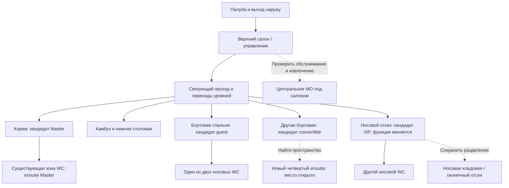

# O02-DESIGN — рабочая основа общей компоновки

10.09.2026. Исполнитель: агент naval_layout. Статус: DOCUMENT_REVIEWED / SEQUENCE_FOR_REVIEW. По последнему уточнению владельца текущий выход — общий порядок проектной работы от общего к частному. Приведённые A/B — будущие направления исследования, не выполненные варианты компоновки. Стройка — Польша по прямому уточнению владельца; город, верфь и флаг здесь не назначены. УТВ означает утверждённую исходную смету / базовый бюджет.

Исходное состояние по владельцу: неокрашенный алюминиевый корпус «под крышу». Изображённые на старых чертежах кровати, техника, танки и паруса не считаются установленными.

## Порядок работы проектной группы

| Этап | Вход | Результат для следующей группы | Критерий перехода |
|---|---|---|---|
| 1. Основания эксплуатации | Поручение владельца; premium brief; стройка в Польше | Согласованные режимы использования, вместимость, автономность, приоритеты комфорта и нормативный базис | Существенные противоречия названы и решения зафиксированы; цели не выданы за установленное |
| 2. Реальная геометрия | Переданные PDF, DWG, 3DM; обследование корпуса | Сопоставленная модель корпуса, конструкций, проёмов и уровней с принятой ревизией | CAD и ключевые натурные размеры сверены; граница известного указана |
| 3. Варианты зон | Этапы 1–2; 3+1 как цель | Сравнение функциональных схем жилых, мокрых, общественных и технических зон | Показаны последствия вариантов, включая четвёртый ensuite; выбран вариант для проверки |
| 4. Проверка вместимости и массы | Выбранная схема; геометрия; предварительные массы всех пакетов | Высоты, проходы, открывания, сценарии койки, сервисные и аварийные маршруты; согласованная весовая модель | Критические конфликты закрыты; расчёты массы/посадки/остойчивости проверены профильной группой |
| 5. Размещение оборудования | Проверенная схема; данные технически подходящих кандидатов | Установочные и сервисные объёмы, трассы, фундаменты, путь извлечения | Оборудование помещается и обслуживается; системы согласованы с интерьером и весом |
| 6. Схемы и спецификации | Зафиксированные решения этапов 1–5 | Рабочие схемы/листы и ведомости количеств по ревизиям для КП, сопоставления КАЦ и УТВ | Выполнена междисциплинарная проверка; позиции прослеживаются к листам и составу комплекта |

Это последовательность принятия решений, с возвратом при изменении входов. Параллельно допустимы изучение производителей и сбор справочных данных о кандидатах. Закупочный выбор и утверждённые количества зависят от проверенной проектной основы. Текущая первичная работа подтверждает необходимость этапов 2–4: исторический лист не содержит четвёртого WC и не устанавливает жилое назначение носовой зоны.

## Что прочитано на чертежах

Оба PDF просмотрены визуально целиком через существующие превью. Дополнительно оригинал GA отрендерен крупными фрагментами для чтения штампа, кормовой/средней части и носового узла. Размеры с пикселей не снимались.

| Источник | Прочитанные реквизиты | Граница использования |
|---|---|---|
| [DOC-003, 7-1.pdf](../../../../../documentation/02-general-arrangement/7-1.pdf), единственная страница | GENERAL LAYOUT, VAN DE STADT 67, 430A-7-1, HK, 21/05/2001, масштаб в штампе 1:20 | Историческое проектное решение; соответствие реальному корпусу и редакции CAD не установлено |
| [DOC-004, 8-1.pdf](../../../../../documentation/03-rig-and-sails/8-1.pdf), единственная страница | SAILPLAN, VAN DE STADT 67, 430A-8-1, HK, 21/05/2001, масштаб 1:50 | Источник конфигурации вооружения; не заказ парусов и не расчёт остойчивости |

SHA-256 DOC-003: `71c31e8ddcea35efb728e7567f18e7a78359f5aadf365bf3f8f5ce006a7a8486`; DOC-004: `d385d61571106e80be1e818969f47170e15d1d23024c074d220a6b3d40485cb1`.

На GA блок Principal dimensions показывает LOA 20,50 м, LWL 17,50 м, B 5,75 м, Draft 2,50 м. Строки Displacement и Ballast (lead) не заполнены. На Sailplan LOA/LWL/B совпадают, но Draft, Displacement, Ballast оставлены незаполненными. Это точная транскрипция источника, а не разрешение заменить противоречащие сведения реального корпуса. Дата экспорта PDF 2016 года не меняет дату штампа 2001 года.

На Sailplan таблица слева вверху: mainsail 131,0 м², jib 110,0 м², total 241,0 м²; stormjib 50,0 м², trysail 39,0 м², reacher 185,0 м²; I 29,00 м, J 8,00 м, P 26,00 м, E 9,10 м. Это площади/параметры, напечатанные автором; их геометрический пересчёт и применимость не проверены. На боковом виде видны одна мачта, гик и несколько передних парусов/штагов; справа отдельная схема мачты. Нельзя складывать весь гардероб в одновременно несомую площадь.

## Существующее решение на GA

Условные координаты ниже: проценты ширины X и высоты Y всей страницы **в исходной портретной ориентации**, от левого верхнего угла. Они только помогают найти область и не являются геометрией яхты. Основной план слева, нос направлен вниз страницы; правый борт яхты находится слева на этом плане. Продольный разрез справа, отдельный план верхнего салона посередине.

| Область листа | Наблюдение | Что остаётся интерпретацией |
|---|---|---|
| План X 3–37%, Y 21–37% | Кормовая жилая зона: центральное спальное место с двумя подушками, бортовая мебель, проход к средней части; один WC с умывальником слева на странице | Название Master и фактические габариты кровати не подписаны; площадь/высоту не выводим |
| План X 13–37%, Y 36–47%; разрез X 70–90%, Y 36–47% | Обособленный центральный объём с толстой границей; в разрезе изображён двигатель под поднятым салоном | Это основание считать объём проектной машинной зоной; состава установки и проходов обслуживания нет |
| План X 3–16%, Y 44–57% | Камбуз: четырёхконфорочный символ плиты и двойная мойка, развитая рабочая поверхность | Модель техники, топливо плиты и реальная комплектация неизвестны |
| План X 18–36%, Y 47–57% | Стол и окружающий диван напротив камбуза | Количество безопасных мест на ходу не установлено |
| План X 7–33%, Y 56–69% | Две бортовые спальни с широкими спальными поверхностями и подушками, центральный проход и шкафы | Назначение VIP/guest и возможность трансформации не заданы |
| План X 10–31%, Y 69–75% | Два WC с умывальниками по сторонам центрального прохода | Частные входы и независимость санузлов по будущему brief требуют проверки дверей и маршрутов |
| План X 11–31%, Y 74–83% | Носовой отсек с длинными бортовыми элементами и центральным свободным участком; дальше отдельный оконечный отсек | Назначение бортовых элементов/отсека не подписано достаточно ясно. Жилую каюту здесь не объявляем существующей |
| Отдельный план X 39–63%, Y 29–54% | Верхний салон с диваном и столом; кресла, консоль и лестница | Функция конкретного кресла/поста и возможность разместить целевой комплект экранов не доказаны |
| Разрез X 66–94%, Y 6–22% | На корме показан контур малой лодки/тендера, под ней объём кормовой части | Реальные размер, масса и способ подъёма тендера отсутствуют |

**Непосредственный конфликт:** прочитаны три символа WC, а premium brief требует четыре индивидуальных ensuite. Наличие трёх отчётливо читаемых спальных зон не доказывает готовность схемы «3+1»: функция носового отсека должна быть установлена отдельно. Любой четвёртый санузел конкурирует с койками, хранением и проходами.

## Направление будущего варианта A — сохранить центральную машинную зону

Цели взяты из [premium brief](../../../../../docs/16-premium-builder-specification.md), разделы Principal target arrangement / Accommodation standard. Следующее распределение — предмет будущего этапа 3, чтобы показать тип вопросов; планировка сейчас не выбрана:

- Кормовая жилая зона — кандидат Master; существующий соседний санузел — кандидат её ensuite. Максимальный объём не означает автоматического расширения через силовую границу или в тендерную зону.
- Носовой отсек перед парой санузлов — кандидат VIP **через изменение назначения**, если подтвердятся высота, спальня, вентиляция, путь выхода и сохранение нужной носовой кладовой. Один существующий носовой санузел изучается для её частного доступа.
- Две нынешние бортовые спальни — кандидат side guest и кандидат convertible. Вариант A: guest по правому борту, convertible по левому; вариант B меняет их местами. Это два задания на сравнение, а не доказанные помещаемые решения.
- Оставшийся существующий носовой санузел рассматривается для guest. Четвёртый, для convertible, ищется в пределах перераспределённой бортовой жилой группы; его положение пока **не назначено**. Не вычитать этот объём из машинной зоны молча.
- Верхний салон, нижняя столовая/камбуз и центральное МО остаются исходными функциональными опорами сравнения. Размещение вспомогательных систем возможно только после совместной проверки установочных и сервисных объёмов.

Схема показывает предполагаемые функциональные связи, **не масштаб, двери или доказанные маршруты эвакуации**. Пунктир к МО означает требование к сервисному доступу, пока не существующий проверенный проход.

Схема A бракуется для дальнейшей деталировки, если VIP или четвёртый ensuite достигаются только перекрытием выхода, разрушением неподтверждённой силовой границы либо отказом от сервисного доступа. Вариант B проверяет зеркальное распределение бортовых функций; это не гарантирует решение носового конфликта. Если оба не проходят, начальнику нужен новый выбор компоновки с явно показанным отступлением от brief. Цель владельца до такого решения сохраняется.

## Задание на следующий проектный проход

Первая геометрическая модель должна воспроизводить существующий корпус, конструкции, настилы, подволок, проёмы и машинную зону по принятой системе координат. Сначала сопоставить DOC-001 3DM / DOC-002 DWG с обоими PDF и обследованием; сейчас CAD ещё не открыт и не верифицирован. Наружную ширину 5,75 м нельзя использовать как внутреннюю свободную ширину.

Для каждой зоны из [layout-zones.csv](layout-zones.csv) нужны установочный объём, рабочая поза человека, открывание дверей/ящиков, обслуживание и вынос самой крупной заменяемой части. Высоту проверять над траекторией головы/плеч, а не только на оси судна. Исследование Savasta et al. отдельно указывает, что неполный учёт главной палубы может давать мебель в зоне недостаточной высоты; отсюда наш обязательный совместный просмотр плана и разреза. [Первичная публикация, §§3.2 и 6–7](https://www.cambridge.org/core/journals/data-centric-engineering/article/humanmachine-teaming-for-leisure-motorboat-layout-design/94FB8C57C1EB83260D615CE6404DB7FF).

Для convertible проверить три конфигурации: нижние раздельные койки; нижняя двойная; верхняя койка разложена. В каждой фиксировать доступ к санузлу, выходу, хранению и вентиляции. Целевой размер койки, состав гостей и пределы крена пока не утверждены; универсальные миллиметры не подставлены.

В машинной зоне проверять двигатель 300 hp, два генератора, чиллеры и резервные системы как **целевые установочные пакеты**, включая опоры, арматуру и извлечение. Соседство Master с МО и тендерной зоной требует акустического и сервисного сравнения. Резервирование не должно зависеть от единственного недоступного общего клапана или электрического шкафа.

С Sailplan передать в проектный пакет позицию мачты и штаг/вантовые силовые связи, после проверки геометрии — ограничения для проходов и новых перегородок. По методике ORC парусный прогноз связан с сопротивлением и восстанавливающим моментом, поэтому прочитанные площади не разрешают назначить новый рангоут без модели масс/корпуса. [ORC, метод VPP](https://orc.org/organization/velocity-prediction-program-vpp).

Выход следующего прохода: два размерных варианта A/B, таблица конфликтов, перечень переносимых границ и связанных изменений систем/масс/стоимости. Площади отделки, длины трасс и количества по смете определять только по принятому варианту и ревизии. До этого реестр целевых помещений не является ведомостью фактических работ для УТВ.

## Передача и проверка

[design-gaps.csv](design-gaps.csv) задаёт отсутствующие данные, способ получения и зависимые решения; [learning-card.md](learning-card.md) фиксирует реальное чтение и выполненное упражнение. Самопроверка: прочитанные размеры отделены от измерений, три WC отделены от цели четыре ensuite, типовые решения не объявлены размещёнными. Независимая проверка и приём начальником ожидаются; гидростатика, прочность, соответствие требованиям и готовность производства не оценивались.
