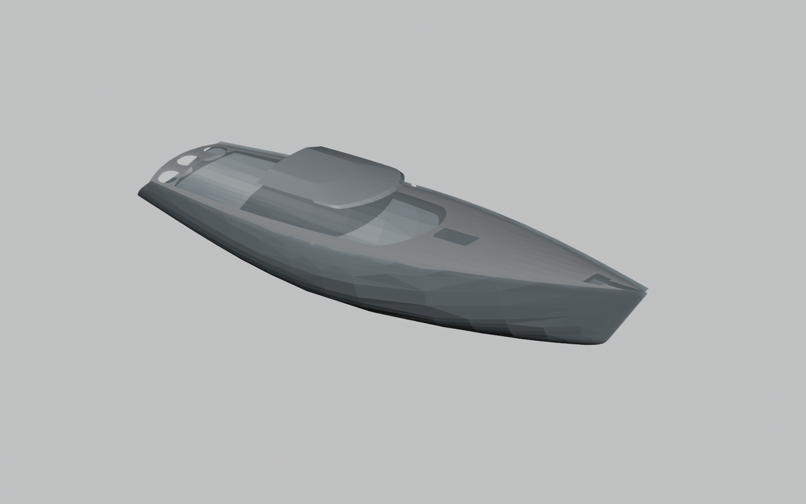

# Наружный 3D-вид существующей цифровой модели

10.09.2026. Вид по восьми выбранным объектам исходного Rhino, перенесённым в T01: оболочки, палуба и крыша. Это упрощённая сеточная подоснова, не полный состав Rhino и не обмер построенного корпуса. Будущие переделки не добавлены.

[Открыть сцену Blender](01_support/exterior.blend). Ракурс и оформление изменены без изменения геометрии T01. Вращение — средняя кнопка мыши; масштаб — колесо. [Исходная подоснова и ограничения](../../T01/v001/01_support/bridge/README.md). Скрипт show.py сохраняет рабочий вид в .local/exterior-view, оригиналы не перезаписывает.
