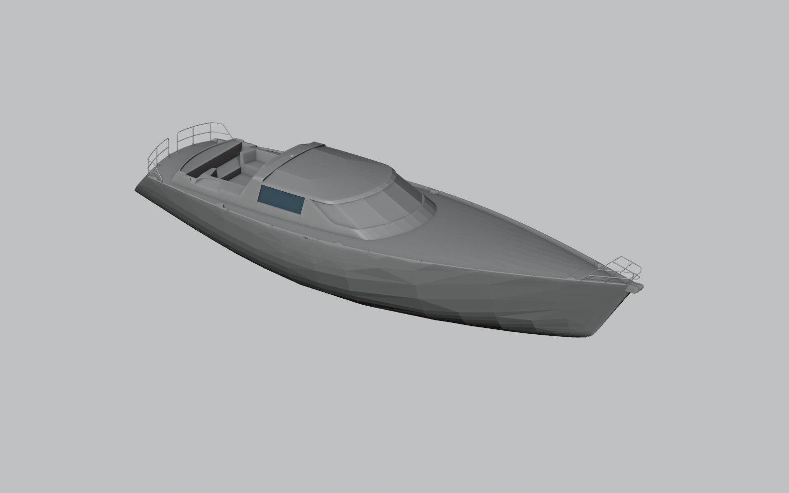

# V02 — все поверхности исходной 3D-модели

10.09.2026. Предыдущий вид V01 был слишком сокращён: только восемь поверхностных объектов. Здесь выведены все 314 Brep исходного `2-1.3dm`: 516 исходных граней, 125026 вершин и 147591 полигон сохранённых render meshes. Показаны дополнительные детали рубки, кокпита, остекления и ограждений. Геометрия не дорисована.

[Открыть наружный вид в Blender](01_support/exterior.blend) · [Исходная сцена без камеры](01_support/full/vds67-reference.blend) · [Проверка](01_support/review.md).

Всего исходник содержит 491 объект. Кривые, текст и точки в этой выдаче не перенесены: это полный набор Brep, но не все типы исходных объектов. Исходные точные поверхности остаются в 3DM; показана их сохранённая сетка. Видимая гранёность не доказывает гранёность проектных NURBS-поверхностей. Ни сглаживание, ни новая тесселяция здесь не выполнялись.

Три переданных ZIP повторно проверены: в каждом один и тот же 2-1.3dm с SHA256 `814ecb9ae6afa27963f288d52df8db9e67d5c43bf967131b89b5ff40f1c3caa8`. Другой уникальной 3D-модели в переданном комплекте не найдено. Это существенно подробнее прежней демонстрации, но полной оснащённой яхты с интерьером и всеми инженерными системами в имеющемся 3D-комплекте не установлено.

Воспроизведение: `tools/cad/rhino_all_breps_to_obj.py --out-dir <новая папка>` через rhino-окружение, затем `blender --background --python tools/cad/blender_all_breps_scene.py -- --bridge-dir <та же папка>`. Для сохранения неиспользованных вершин OBJ читается явно через from_pydata: стандартный OBJ-импорт удалял часть таких вершин. Исходники, T01 и V01 не меняются.
