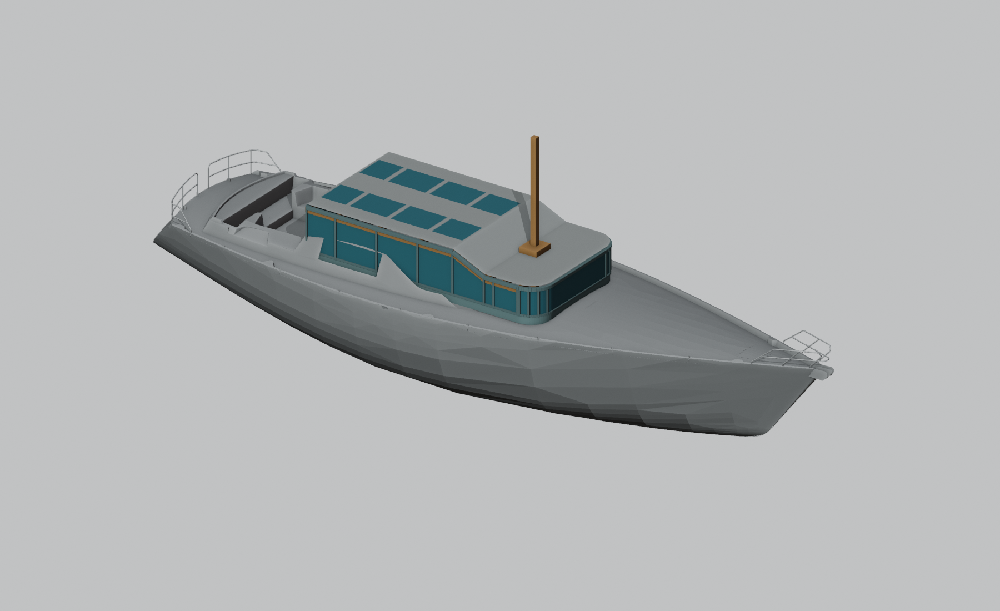
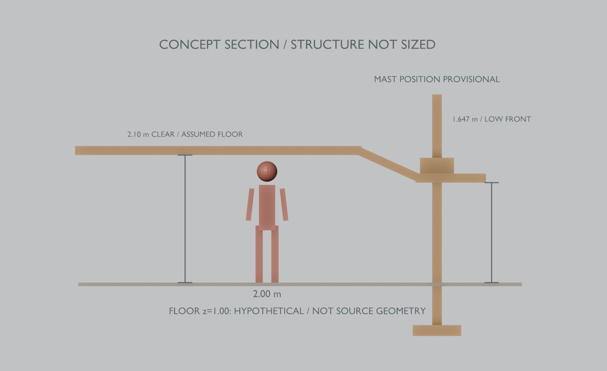

# EXP-001 — светлая рубка с продлением вперёд и поднятой кормовой крышей

10.09.2026. **Первое экспериментальное предложение, не утверждённый проект.** Отдельная [папка сопровождения](01_support/); оригинальные чертежи и опубликованные модели не изменены.

Предлагаю двухуровневую крышу: впереди — невысокая часть со степсом, позади мачты — наклонный переход к более высокой проходной зоне. Вертикальное остекление идёт по бортам и закругляется на передних углах. Продольные и поперечные связи разделяют верхние световые поля; зона мачты остаётся без светового выреза.

[Открыть эксперимент в Blender](01_support/model/experiment.blend) · [Крыша крупно](01_support/model/roof-detail.png) · [Боковой вид с размером](01_support/model/side.png).

## Как истолковано задание

- **3,00 м вперёд отсчитаны от переднего края нынешней крыши**, X≈−10.798→−7.798 м. Нижнее основание старого наклонного лба находится впереди, X≈−9.100 м; отсчёт от него дал бы другой вариант, до X≈−6.100 м. Подтверждения владельцем выбранной точки отсчёта ещё нет.
- «После мачты» в первом варианте означает **в сторону кормы**. Наклонный переход расположен позади условной оси мачты. Это рабочее толкование для обсуждения.
- 90° означает **вертикальные поверхности остекления относительно горизонтальной рабочей плоскости**, а не перпендикуляр к криволинейной обшивке корпуса. Предложен радиус передних углов 0,65 м и ширина около 3,74 м; эти два размера не являются заданием владельца или расчётными решениями.
- Передняя плоская крыша задана по высоте максимума старой крыши, Z≈2,897 м. Это сохраняет общий высотный ориентир, но **не повторяет старый передний профиль**: его верх ниже, около Z≈2,777 м.
- Ось мачты показана условно на X=−9,2 м, внутри ориентировочного диапазона по Sailplan. Коричневый короткий маркер — обозначение оси, а не проект новой мачты. Точный степс не установлен по обмеру.

## Высота для человека ростом 2 м

Проверочный пол задан **только для эксперимента** на Z=1,00 м. При наружном верху кормовой крыши Z=3,35 м и условном резерве 0,25 м на крышу/набор/потолок получается:

**3,35 − 0,25 − 1,00 = 2,10 м чистого просвета.**

Двухметровый человек показан в этой зоне. Толщина 0,25 м — зарезервированный объём, не подобранное сечение конструкции. После установления чистого пола и фактических нижних препятствий отметку крыши пересчитать по правилу: `чистый пол + требуемый просвет + конструкция/отделка над ним`.

Впереди при том же полу остаётся лишь **1,647 м**. Следовательно, этот вариант **не обеспечивает проход двухметрового человека по всей рубке**. Предложение для низкой передней зоны — сидение/рабочие поверхности либо отдельное исследование более низкого пола. Не следует молча опускать пол без проверки нижних помещений и конструкций. Если нужен непрерывный проход в полный рост и впереди, придётся пересмотреть высоту передней крыши или уровни настила.

## Свет и жёсткость

Предложены боковое/лобовое остекление и восемь верхних световых полей в двух рядах, между продольными полосами и поперечными связями. В плане световые поля отделены от рам и зоны мачты. Для реального комфорта дополнительно нужны затенение, вентиляция и проверка бликов; освещённость и перегрев не рассчитывались.

Под степсом показана отдельная передача нагрузки через местную опорную вставку и пиллерс к нижнему основанию. **Стекло не является опорой мачты.** Положение пиллерса влияет на внутренний проход; нижний фундамент в существующем корпусе пока не найден и не назначен. Балки, стойки и размеры стекла в сцене показывают принцип и резерв места, их прочность не подтверждена. [Инженерная записка с официальными источниками](01_support/engineering-notes.md) задаёт дальнейшую проверку степса/пиллерса и остекления.

## Что нужно решить следующим

1. Привязать чистый пол, точную ось/отметку мачты и существующий набор. Подтвердить отсчёт продления и требование прохода в передней зоне.
2. Переработать сопряжение с существующими комингсами #383/#389: они оставлены видимыми и местами пересекают новое остекление. Это незакрытый стык, не готовое монтажное решение.
3. Совместить опору мачты с планировкой и фундаментом; проверить наклон крыши относительно гика, парусов, такелажа и обзора. Затем рассчитать конструкцию, остекление, массу и влияние переделки на остойчивость.

На мой взгляд, **эта двухуровневая схема подходит как направление эксперимента**: низкая передняя часть сохраняет более спокойный силуэт, повышенная кормовая часть даёт резерв высоты, а световые поля не вытесняют весь силовой набор. Самое важное незакрытое решение — уровень пола и допустимая высота передней зоны.

[Геометрические основания](01_support/basis/basis.md) · [Параметры и состав сцены](01_support/model/README.md) · [Независимая проверка](01_support/review/review.md).
