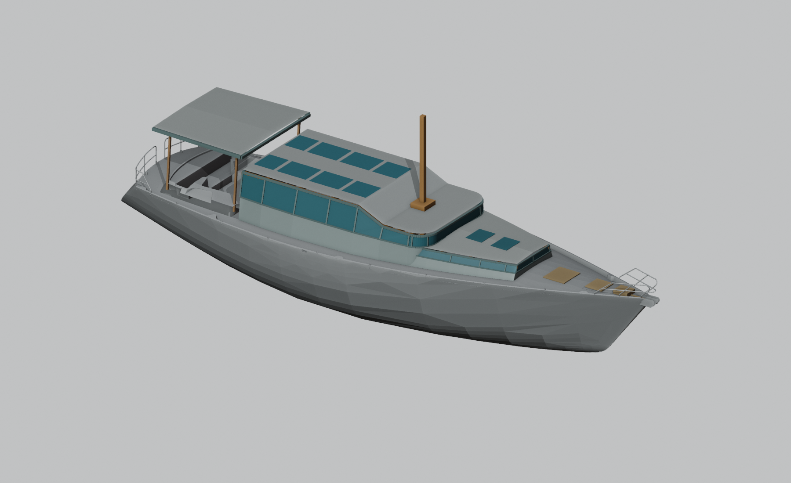

# EXP-002 — ступенчатая надстройка и хардтоп кокпита

10.09.2026. Отдельная корректировка EXP-001 по замечанию владельца: вместо вертикальных бортовых стенок — наклонная надстройка с широким основанием и проходами по бортам. Верхняя крыша сохраняется; ещё 3 м вперёд занимает отдельная низкая часть с невысоким остеклением. Кокпит получает открытый по бокам хардтоп.

Это экспериментальная форма. Исходники и EXP-001 не изменены. [Папка сопровождения](01_support/) содержит основания, параметры, проверку и изображения.

[Открыть в Blender](01_support/model/experiment.blend) · [Вид сверху: проходы](01_support/model/top.png) · [Боковой вид](01_support/model/side.png) · [Детали](01_support/model/detail.png).

## Что изменено

1. **Верхняя крыша сохранена по габаритам EXP-001.** Расширение перенесено вниз, к палубе: боковые поверхности наклонены. Степень расширения уменьшается по мере сужения палубы.
2. **Добавлено ещё 3 м низкой передней надстройки:** от прежнего экспериментального лба X−7.798 до X−4.798. Высокая крыша не вытянута целиком до нового переднего края.
3. **Непрозрачная нижняя часть поднята, окна уменьшены.** «Поднять палубу до половины» истолковано как повышение наружного комингса примерно на половину прежнего лобового окна. Это не подтверждённый подъём чистого пола внутри.
4. **Оставлены боковые проходы.** Форма нового носа сужается по исходной палубе. Плановый геометрический резерв ещё не равен чистой полезной ширине между выступами, стойками и открытыми люками.
5. **Впереди выделено место под форпик и якорное хозяйство.** Люки и лебёдка показаны как предложения по размещению, без подтверждения внутреннего объёма, цепного тракта, марки оборудования или доступа.
6. **Кокпит накрыт отдельным хардтопом**, с открытыми боками. Высота и опоры требуют проверки относительно реальных площадок и рангоута; сечения конструкции не рассчитаны.

## Параметры первого варианта

- Прежняя верхняя крыша сохранена вместе со ступенью и верхними световыми полями.
- Нижняя граница прежнего лобового стекла поднята с Z2.03 до Z2.4135; его верх Z2.797. Поэтому видимая высота этой полосы уменьшена вдвое, с 0.767 до 0.3835 м.
- Крыша нового низкого продолжения имеет кромки примерно Z2.41 у стыка и Z2.36 у носа, со сводом на 0.055 м выше; высота его боковой полосы остекления предложена около 0.24 м. Это новые эскизные размеры, не высота помещения.
- Для проходов задан ориентир 0.55 м до наружной кромки палубы. Фактические значения в проверочных сечениях определяются по новой геометрии; препятствия и выступы ещё не вычтены.
- Хардтоп поднят отдельно: верх у краёв около Z3.90–3.92, местный свод добавляет до 0.04 м; нижние поперечные связи около Z3.75–3.77. Над высокой площадкой-кандидатом Z1.62 это даёт около 2.13 м по вертикали. Назначение площадок, точный чистый пол, опоры и зазоры до рангоута ещё требуют подтверждения.

Хардтоп в плане простирается примерно от X−18.72 до X−15.109: продольный охват кормовой площадки #58 закрыт. У площадки-кандидата #212 остаётся около 0.116 м впереди границы хардтопа, в сторону основной рубки. Крайние точки бортового обрамления-кандидата #457 также покрыты не полностью. Стыковку входа, крайние места и местные высоты на переходе надо проверить отдельно.

Все отметки относятся к рабочей системе G02; Z0 не является полом. [Параметры и метод построения](01_support/model/README.md).

## Почему носовая часть сужается

У нового переднего края X−4.798 ширина палубы около 3.362 м. Если зарезервировать по 0.50 м в плане с двух сторон, основание надстройки не должно быть шире примерно 2.362 м. Поэтому прямоугольное продолжение прежней ширины сюда не подходит. В средней части палуба шире, и основание можно раскрыть сильнее.

Это сравнение с наружными кромками исходного Rhino, а не обмер или утверждённая норма прохода. [Прямые сечения палубы](01_support/basis/basis.md) и [трактовка поручения](01_support/brief.md) сохраняют исходные данные и ограничения.

## Что ещё не решено

Пол и чистая высота помещений не установлены; наследование крыши не устраняет ограничения EXP-001 по проходу человека ростом 2 м. Точная мачта/степс, опоры надстройки и хардтопа, нагрузки, масса, остойчивость, обзор и зазоры до гика/парусов остаются следующими проверками. Носовые устройства требуют проверки снизу, а не только красивого размещения люков на палубе.

[Принцип формы и дальнейшие проверки](01_support/design-intent.md).

[Независимая проверка](01_support/review/review.md) · [Приёмка и состав](01_support/acceptance.md).
