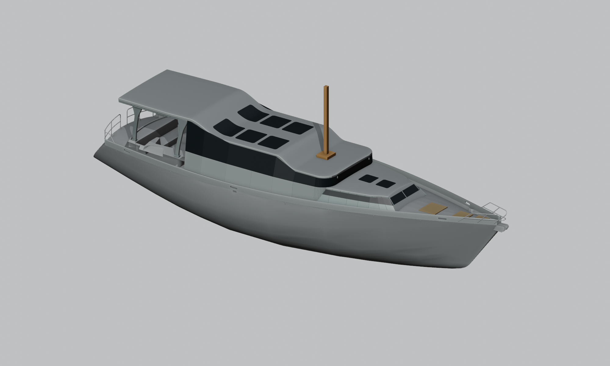

# EXP-003 — фальшборт и плавные сопряжения надстройки

10.09.2026. Следующая итерация по подтверждённому владельцем замыслу EXP-002: более цельный наружный облик, наклонный носовой лоб и связанный с рубкой хардтоп. Отдельная экспериментальная модель; исходники и предыдущие варианты сохраняются.

[Сцена Blender](01_support/model/experiment.blend) · [Вид сбоку](01_support/model/side.png) · [Вид сверху](01_support/model/top.png) · [Сопряжения](01_support/model/detail.png).

## Изменения

- Алюминиевый фальшборт поднят на 25 см относительно его исходной верхней кромки. По обоим бортам показаны клюзы в носовой, средней и кормовой частях.
- Передний лоб низкой надстройки скошен на 45° в продольном профиле. Верх отведён назад, сохраняя место на носовой палубе.
- Стёкла затемнены; крыша получила более мягкую кривизну и скруглённые кромки.
- Хардтоп связан с крышей плавным переходом, а с корпусом — четырьмя предложенными опорами с расширением у верхних узлов. Понижение перенесено вперёд над рубкой, чтобы сохранить высоту в кокпите. Боковые стороны кокпита остаются открытыми.

Клюзы размещены попарно в носовой, средней и кормовой частях. Их положения и размеры — эскизные, без выбора серийного изделия или расчёта швартовной нагрузки. [Основание фальшборта](01_support/basis/basis.md) связывает прибавку с конкретными поверхностями исходного Rhino.

Отметки модели относятся к чертёжной системе G02; её ноль не является чистым полом. Геометрические контакты опор с исходной оболочкой не подтверждают наличие нужного силового набора под ними.

## Проверяемые размеры и узлы

- Прибавка фальшборта — 0.250 м по вертикали от его прежнего верха. Шесть клюзов имеют предложенный световой габарит около 0.36×0.10 м.
- Над основными площадками кокпита #52/#58/#212 расчёт геометрического резерва даёт соответственно около 2.427 / 2.150 / 2.055 м. Это условные зазоры от поверхностей чертежа до зарезервированного низа крыши/рам, а не подтверждение чистой высоты для человека по всей яхте.
- В проверенных сечениях между основанием надстройки и **внутренней** границей нового фальшборта остаётся минимум около 0.488 м в плане. Выступы, опоры, ограждения, открывание люков и движение человека ещё не вычтены.
- Четыре опоры имеют контактные башмаки: передние на исходном обрамлении #454/#457, кормовые на горизонтальных поверхностях кокпита #67/#93. Их расположение и контакт проверяются отдельно от наличия силового набора под ними.
- В крыше восемь световых проёмов: шесть в высокой части и два в низком носовом продолжении. Стеклянные заполнения повторяют кривизну крыши.

[Параметры и воспроизведение](01_support/model/README.md) · [Просветы](01_support/model/transition-clearances.json) · [Боковые зазоры](01_support/model/inner-bulwark-gaps.json).

## Граница результата

Это предложение формы и расположения узлов. Размеры силовых элементов, сварные соединения, местное усиление корпуса, нагрузки швартовов, масса и остойчивость ещё не рассчитаны. Полезные проходы, обзор, водоотвод и зазоры до гика/такелажа требуют дальнейшей проверки. Тёмный материал на изображении не определяет светопропускание или состав реального остекления.

[Задание](01_support/brief.md) · [Следующие технические проверки](01_support/design-intent.md) · [Сопровождение](01_support/).

[Независимая проверка](01_support/review/review.md) · [Приёмка и состав](01_support/acceptance.md).
